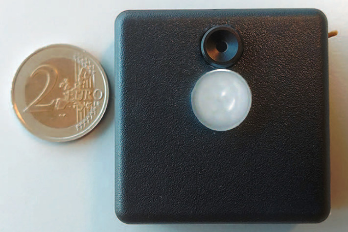

# Privacy-aware, Low-power, Occupancy detection of Multiple People using a Thermophile Sensor

Privacy-aware, low-power, and device-free indoor occupancy detection is highly sought after in order to enable smart environments. IR-based solutions seem to obey to these demands, however, are quite limited in terms of real-life application due to several obstacles. So, another, more appropriate solution, is to be found. For this, Ranga Rao and Sujay from the Networked and Embedded Systems group of the TU Delft already developed a device that integrates, among others, a thermophile sensor. For me, it is now the task to explore the sensor usage possibilities. This is done so I can get more familiar with three topics:
1. Acquiring sensor data appropriately
2. Applying computer vision techniques to detect people based on IR information
3. Sending information extracted from the sensor, using the MQTT protocol, to the server.


## Hardware:
Hardware used in the project:
- Computer
- LOCI device housing thermopile and PIR sensors (see image)

   


## Technologies:
Languages, libraries and versions used in the project:
- Python 3.8 with libs asyncio, math, struct, and datetime
- Microsoft .NET SDK 6.0
- Serial 3.5
- Numpy 1.22
- Matplotlib 3.4.2
- OpenCV 4.5.5
- Azure IoT Python SDK v2
- Azure IoT C SDK v1


## Launch
Since this is a development project, no command line UI was added, the code is run simply by one line:
``` 
$ python project_main.py
 ```
When the code is run without any adjustments it will default to detecting people in one frame that is given by the exemplary data. This, however, can be changed by adjusting three constants at the beginning of the _project_main.py_ file:
- LIVE
- VID
- CONTOUR

The LIVE constant can be set to True if it is desired to deal with live serial data from the LOCI device
The VID constant can be set to True if it is desired to show an entire sequence of frames in which people are searched for. This only works when the LIVE equals True. 
The CONTOUR constant can be set to False if it is not desired that contours are shown around the detect people in a frame


## Contact
Kilian van Berlo - S5436737 - k.vanberlo@student.tudelft.nl

Project Link: https://github.com/KilianBerlo/LOCI